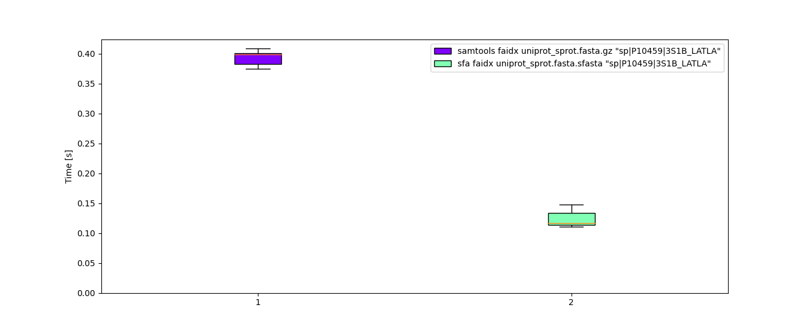
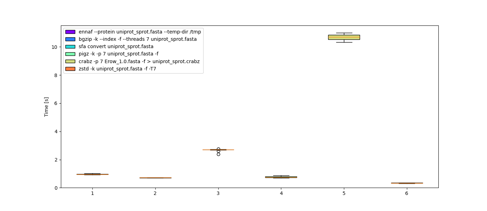
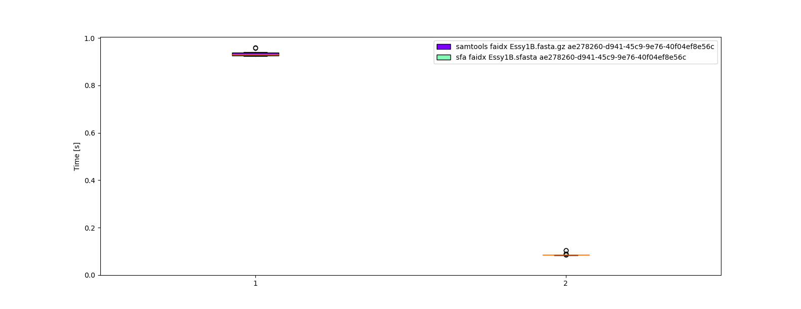
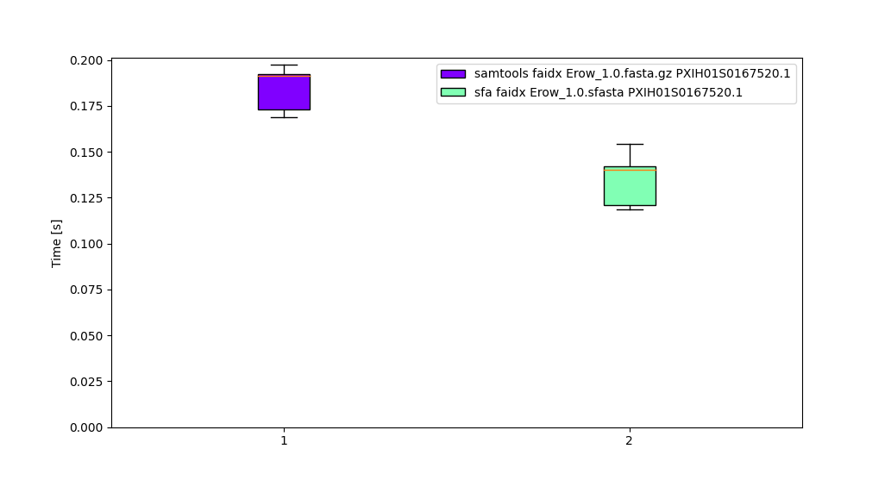
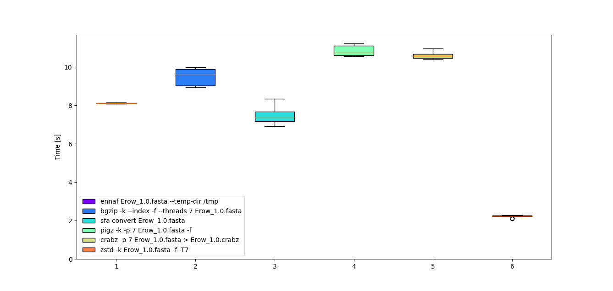

# Introduction
Sfasta is a replacement for the FASTA/Q format with a goal of both saving space but also having very fast random-access for machine learning, even for large datasets (such as the nt database, 217Gb gzip compressed, 225Gb bgzip compressed). Speed advantages are by assuming modern hardware, thus: i) multiple compression threads, ii) I/O dedicated threads, iii) SIMD bitpacking support, iv) modern compression algorithms (ZSTD, as default). If you need different hardware, open an issue. There are SIMD support for other architectures that could be implemented.

While the goals are random-access speed by ID query, and smaller size, I hope it can become a more general purpose format. Currently it makes extensive use of bitpacking, as well as ZSTD compression. It supports others, which could be used for archival purposes (such as xz compression). It is a work in progress, but is ready for community feedback. Because the goals are not simple decompression, this part of the code is not-optimized yet, and is much slower than zcat or other tools. This will be remedied in the future.

## Note
This has taken a few years of on again, off again development. FORMAT.md and other files are likely out of date.

# Usage
## Installation
`cargo install sfasta`

## Usage
To compress a file:
`sfa convert MyFile.fasta`

You can also convert directly from gzipped files
`sfa convert MyFile.fasta.gz`

You can use other compression schemes. The software automatically detects which is used and decompresses accordingly.
`sfa convert --snappy MyFile.fasta`
`sfa convert --xz MyFile.fasta`

For help:
`sfa --help`

Please note, not all subcommands are implemented yet. The following should work: convert, view, list, faidx.
# Comparisons

## Features
| Compression Type | Random Access | Multithreaded |
|:---:|:---:|:----|
| NAF | No | No |
| ZSTD | No | Yes |
| sfasta | Yes | Yes |
| bgzip | Yes | Yes |

### Uniprot Random Access
Samtools index pre-built

| Command | Mean [ms] | Min [ms] | Max [ms] | Relative |
|:---|---:|---:|---:|---:|
| `samtools faidx uniprot_sprot.fasta.gz "sp\|P10459\|3S1B_LATLA"` | 422.7 ± 4.7 | 417.8 | 433.3 | 3.42 ± 0.25 |
| `sfa faidx uniprot_sprot
.fasta.sfasta "sp\|P10459\|3S1B_LATLA"` | 123.5 ± 8.9 | 118.3 | 141.6 | 1.00 |

### Uniprot Compression Speed
| Command | Mean [ms] | Min [ms] | Max [ms] | Relative |
|:---|---:|---:|---:|---:|
| `ennaf --protein uniprot_sprot.fasta --temp-dir /tmp` | 966.5 ± 32.2 | 924.6 | 1018.7 | 2.89 ± 0.18 |
| `bgzip -k --index -f --threads 7 uniprot_sprot.fasta` | 719.7 ± 7.6 | 706.6 | 731.0 | 2.16 ± 0.12 |
| `sfa convert uniprot_sprot.fasta` | 2676.7 ± 105.9 | 2394.8 | 2756.2 | 8.02 ± 0.53 |
| `pigz -k -p 7 uniprot_sprot.fasta -f` | 771.5 ± 55.2 | 704.2 | 872.3 | 2.31 ± 0.21 |
| `crabz -p 7 Erow_1.0.fasta -f > uniprot_sprot.crabz` | 10688.8 ± 224.7 | 10322.6 | 10990.7 | 32.01 ± 1.82 |
| `zstd -k uniprot_sprot.fasta -f -T7` | 333.9 ± 17.6 | 303.4 | 351.6 | 1.00 |

### Uniprot Size
Uncompressed: 282M

| Compression Type | Size |
| --- | --- |
| NAF | 68M |
| bgzip* | 92M |
| zstd | 78M | 
| sfasta | 83M |
* Excludes index

## Nanopore Reads
### Nanopore Reads Compression Speed

### Nanopore Reads Random Access
Samtools index pre-built

| Command | Mean [ms] | Min [ms] | Max [ms] | Relative |
|:---|---:|---:|---:|---:|
| `samtools faidx Essy1B.fasta.gz ae278260-d941-45c9-9e76-40f04ef8e56c` | 935.1 ± 13.4 | 923.2 | 959.8 | 10.91 ± 0.65 |
| `sfa faidx Essy1B.sfasta ae278260-d941-45c9-9e76-40f04ef8e56c` | 85.7 ± 4.9 | 83.1 | 104.6 | 1.00 |

### Nanopore Reads Size
Uncompressed Size: 8.8G
| Compression Type | Size |
| --- | --- |
| NAF | 2.2G |
| bgzip* | 2.6G |
| sfasta | 2.6G |

* Excludes index

## Genome

### Genome Random Access Speed
Samtools index pre-built

| Command | Mean [ms] | Min [ms] | Max [ms] | Relative |
|:---|---:|---:|---:|---:|
| `samtools faidx Erow_1.0.fasta.gz PXIH01S0167520.1` | 184.6 ± 10.6 | 169.0 | 197.4 | 1.38 ± 0.15 |
| `sfa faidx Erow_1.0.sfasta PXIH01S0167520.1` | 134.0 ± 12.1 | 118.4 | 154.1 | 1.00 |

### Genome Compression Speed
| Command | Mean [s] | Min [s] | Max [s] | Relative |
|:---|---:|---:|---:|---:|
| `ennaf Erow_1.0.fasta --temp-dir /tmp` | 8.111 ± 0.018 | 8.087 | 8.145 | 3.65 ± 0.11 |
| `bgzip -k --index -f --threads 7 Erow_1.0.fasta` | 9.492 ± 0.442 | 8.940 | 9.975 | 4.27 ± 0.24 |
| `sfa convert Erow_1.0.fasta` | 7.499 ± 0.477 | 6.914 | 8.345 | 3.37 ± 0.24 |
| `pigz -k -p 7 Erow_1.0.fasta -f` | 10.833 ± 0.271 | 10.548 | 11.213 | 4.87 ± 0.19 |
| `crabz -p 7 Erow_1.0.fasta > Erow_1.0.crabz` | 10.594 ± 0.171 | 10.387 | 10.971 | 4.76 ± 0.16 |
| `zstd -k Erow_1.0.fasta -f -T7` | 2.224 ± 0.067 | 2.087 | 2.291 | 1.00 |

### Genome Size 
Uncompressed: 2.7G

| Compression Type | Size |
|---|--|
| NAF | 446M |
| sfasta | 596M |
| bgzip* | 635M |
| Zstd | 663M |

* Excludes index

# Future Plans
## Additional Speed-ups
There is plenty of room for additional speed-ups, including adding more threads for specific tasks, CPU affinities, native compilation, and probably using more Cow.

## Additional Compression
There is likely room to decrease size as well without hurting speed.

## Command-line interface
As I've refactored much of the library, the CLI code withered and decayed. Need to fix this.

## Quality Scores
To support FASTQ files

## Adjust compression level and compression method
For other applications (such as long term storage)

## C and Python bindings
To make it easier to use in other programs and in python/jupyter

## Small file optimization
Sfasta is currently optimized for larger files.

## Implement NAF-like algorithm
NAF has an advantage with 4bit encoding. It's possible to implement this, and use 2bit when possible, to gain additional speed-ups. Further, there is some SIMD support for 2bit and 4bit DNA/RNA encoding.

## GFA file format support
Graph genome file format is in dire need of an optimized format

## Profile Guided Optimization
Never mind. This somehow doubled the time it takes to compress binaries. Enable PGO for additional speed-ups

# FAQ

## I get a strange symbol near the progress bar
You need to install a font that supports Unicode. I'll see if there is a way to auto-detect.

## XZ compression is fast until about halfway, then slows to a crawl.
The buffers can store lots of sequence, but the compression algorithm takes longer.

